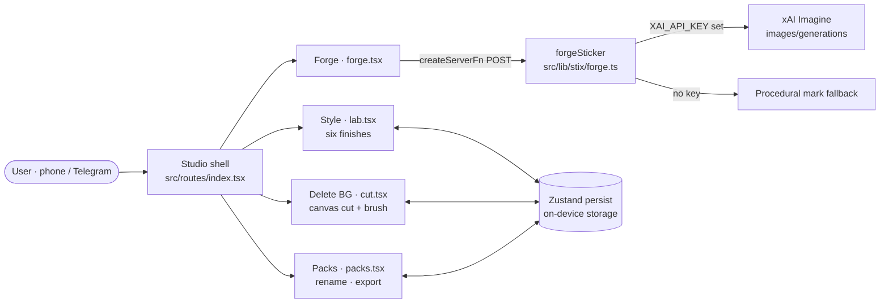

<p align="center">
  
</p>

# STIX MΛGIC

    

Telegram Mini App for sticker alchemy. Delete a background, forge a mark from an idea, file a pack.

## Studio

- **Style** — six finishes on a living hero
- **Delete BG** — photo in, transparent sticker out, brush to tidy the edge
- **Forge** — text to sticker, six forges a sitting
- **Packs** — collect, rename, export for Telegram

Packs live on the device. No account required.

## Architecture

A single TanStack Start app. The Studio views run in the browser, packs persist on the device through Zustand `persist` (key `stix-magic-v3`), and only Forge makes a server call.



## Run

```bash
npm install
npm run dev
```

Forge uses `XAI_API_KEY` on the server when present. Without it, Forge falls back to a procedural mark.

## Scripts

| Command | What it does |
|---|---|
| `npm run dev` | Vite dev server on port 8080 |
| `npm run build` | Production build, then `db:migrate` |
| `npm test` | Node test runner (scripts + app-data tests) |
| `npm run lint` / `npm run typecheck` | ESLint / `tsc --noEmit` |

## Environment variables

Names only:

- `XAI_API_KEY`: optional, enables xAI Imagine for Forge (server-side only)
- `DATABASE_URL`: optional Postgres for the auth/app-data layer. PGlite is used when it's unset.

## Deploy

The `Dockerfile` builds a standalone Node server (`NITRO_PRESET=node-server`, auth disabled with `VITE_AUTH_ENABLED=false`) and runs `.output/server/index.mjs` on port 3000, for self-hosting with Docker/Dokploy.

## Stack

TanStack Start, React, Tailwind, Zustand, canvas cut, xAI Imagine for Forge.
